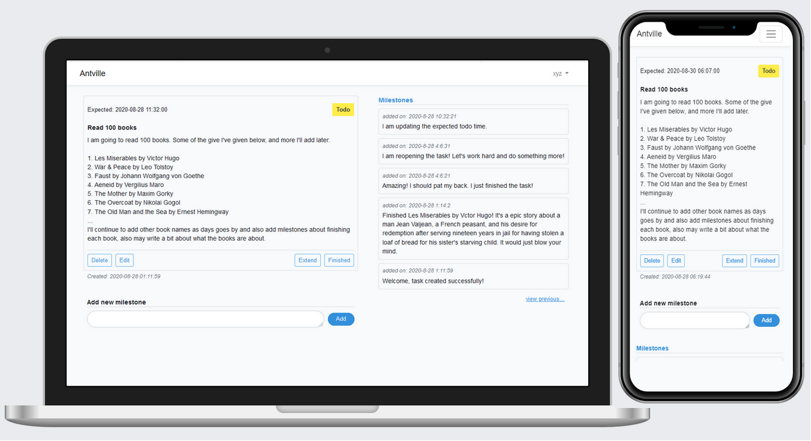

# Antville

`Antville` is an activity tracking tool for personal tasks. Tasks could be anyone's daily life activities or it could be anyone's job, hobbies etc. You can easily track your tasks/activities and measure your progress using `Antville`.



### Live
A live version of `Antville` is hosted on heroku. You may visit the live version [here](http://antville.herokuapp.com).

### Hosting on local environment
You can host this project on a local environment. To host it, you must have `php` and `composer` installed locally and also have a running instance of postgre db server. You may have to follow commands given below:
  
First, you must clone this repo and switch to project root:  

```
$ git clone https://github.com/reyadussalahin/antville.git/
$ cd antville
```

Then, you've to do download the dependency using the following command:
```
$ composer install
```

Now, you've to configure db password, db name etc. For that, you should copy `.env.example` to `.env` and rewrite the portion of DB as your requirement. Don't forget to set `DB_CONNECTION=pgsql`.

Also, if your APP_KEY is missing, then install it using the following command:
```
$ php artisan key:generate
```

Make sure, your db server is running, and then create necessary tables by running the command below:
```
$ php artisan migrate
```

At last, run the web server:
```
$ php artisan serve
```

You can visit `127.0.0.1:8000` to see `Antville` running in local environment.


## LICENSE
To learn about the project license, visit [here](https://github.com/reyadussalahin/Antville/blob/master/LICENSE.md).


## Contributing
The project is ongoing and it has a lot of potential to grow. So, if you've any ideas or improvements, send a pull request. I'll have a look, and also your name'll be added to supporters list if you contribute.

## Supporters
[Md. Reyadus Salahin](https://github.com/reyadussalahin)